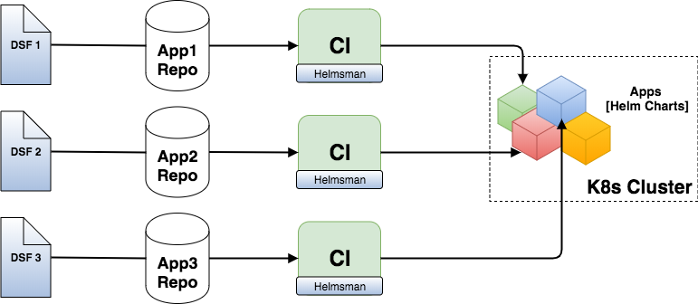

# Deployment Strategies

This document describes the different strategies to use Helmsman for maintaining your helm charts deployment to k8s clusters.

## Deploying 3rd party charts (apps) in a production cluster

Suppose you are deploying 3rd party charts (e.g. Jenkins, Jira ... etc.) in your cluster. These applications can be deployed with Helmsman using a single desired state file. The desired state tells helmsman to deploy these apps into certain namespaces in a production cluster.

You can test 3rd party charts in designated namespaces (e.g, staging) within the same production cluster. This also can be defined in the same desired state file. Below is an example of a desired state file for deploying 3rd party apps in production and staging namespaces:

```toml
[metadata]
  org = "example"

# using a minikube cluster
[settings]
  kubeContext = "minikube"

[namespaces]
  [namespaces.staging]
    protected = false
  [namespaces.production]
    protected = true

[helmRepos]
  jenkins = https://charts.jenkins.io
  center = https://repo.chartcenter.io

[apps]

  [apps.jenkins]
    name = "jenkins-prod" # should be unique across all apps
    description = "production jenkins"
    namespace = "production"
    enabled = true
    chart = "jenkins/jenkins"
    version = "2.15.1" # chart version
    valuesFiles = [ "../my-jenkins-common-values.yaml", "../my-jenkins-production-values.yaml" ]


  [apps.artifactory]
    name = "artifactory-prod" # should be unique across all apps
    description = "production artifactory"
    namespace = "production"
    enabled = true
    chart = "center/jfrog/artifactory"
    version = "11.4.2" # chart version
    valuesFile = "../my-artificatory-production-values.yaml"


  # the jenkins release below is being tested in the staging namespace
  [apps.jenkins-test]
    name = "jenkins-test" # should be unique across all apps
    description = "test release of jenkins, testing xyz feature"
    namespace = "staging"
    enabled = true
    chart = "jenkins/jenkins"
    version = "2.15.1" # chart version
    valuesFiles = [ "../my-jenkins-common-values.yaml", "../my-jenkins-testing-values.yaml" ]
```

```yaml
metadata:
  org: "example"

# using a minikube cluster
settings:
  kubeContext: "minikube"

namespaces:
  staging:
    protected: false
  production:
    protected: true

helmRepos:
  jenkins: https://charts.jenkins.io
  center: https://repo.chartcenter.io

apps:
  jenkins:
    name: "jenkins-prod" # should be unique across all apps
    description: "production jenkins"
    namespace: "production"
    enabled: true
    chart: "jenkins/jenkins"
    version: "2.15.1" # chart version
    valuesFile: "../my-jenkins-production-values.yaml"

  artifactory:
    name: "artifactory-prod" # should be unique across all apps
    description: "production artifactory"
    namespace: "production"
    enabled: true
    chart: "center/jfrog/artifactory"
    version: "11.4.2" # chart version
    valuesFile: "../my-artifactory-production-values.yaml"

  # the jenkins release below is being tested in the staging namespace
  jenkins-test:
    name: "jenkins-test" # should be unique across all apps
    description: "test release of jenkins, testing xyz feature"
    namespace: "staging"
    enabled: true
    chart: "jenkins/jenkins"
    version: "2.15.1" # chart version
    valuesFile: "../my-jenkins-testing-values.yaml"

```

You can split the desired state file into multiple files if your deployment pipelines requires that, but it is important to read the notes below on using multiple desired state files with one cluster.

## Working with multiple clusters

If you use multiple clusters for multiple purposes, you need at least one Helmsman desired state file for each cluster.


## Deploying your dev charts

If you are developing your own applications/services and packaging them in helm charts, it makes sense to automatically deploy these charts to a staging namespace or a dev cluster on every source code commit.

Often, you would have multiple apps developed in separate source code repositories but you would like to test their deployment in the same cluster/namespace. In that case, Helmsman can be used [as part of your CI pipeline](how_to/deployments/ci.md) as described in the diagram below:

> as of v1.1.0 , you can use the `ns-override`flag to force helmsman to deploy/move all apps into a given namespace. For example, you could use this flag in a CI job that gets triggered on commits to the dev branch to deploy all apps into the `staging` namespace.



Each repository will have a Helmsman desired state file (DSF). But it is important to consider the notes below on using multiple desired state files with a single cluster.

If you need supporting applications (charts) for your application (e.g, reverse proxies, DB, k8s dashboard, etc.), you can describe the desired state for these in a separate file which can live in another repository. Adding such a file in the pipeline where you create your cluster from code makes total "DevOps" sense.

## Notes on using multiple Helmsman desired state files for the same cluster

Helmsman v3.0.0-beta5 introduces the `context` stanza.
When having multiple DSFs operating on different releases, it is essential to use the `context` stanza in each DSF to define what context the DSF covers. The user-provided value for `context` is used by Helmsman to label and distinguish which DSF manages which deployed releases in the cluster. This way, each helmsman operation will only operate on releases within the context defined in the DSF.

When having multiple DSFs be aware of the following:

- If no context is provided in the DSF (or merged DSFs), `default` is applied as a default context. This means any set of DSFs that don't define custom contexts can still operate on each other's releases (same behavior as in Helmsman 1.x).

  - If you don't define context in your DSFs, you would need to use the `--keep-untracked-releases` flag to avoid different DSFs deleting each other's releases.

- When merging multiple DSFs in one Helmsman operation, context from the firs DSF in the list gets overridden by the context in the last DSF.

  - If multiple DSFs use the same context name, they will mess up each other's releases.

- If two releases from two different DSFs (each with its own context) have the same name and namespace, Helmsman will only allow the first one of them to be installed. The second will be blocked by Helmsman.

- If you deploy releases from multiple DSF to one namespace (not recommended!), that namespace's protection config does not automatically cascade between DSFs. You will have to enable the protection in each of the DSFs.

Also please refer to the [best practice](best_practice.md) document.
