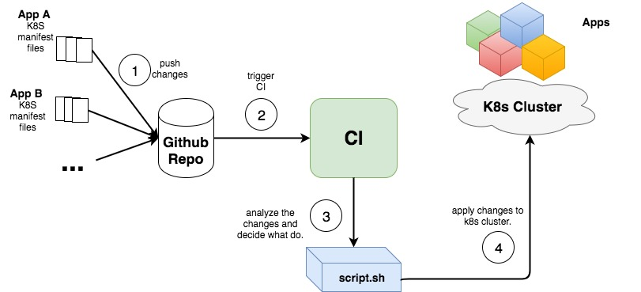
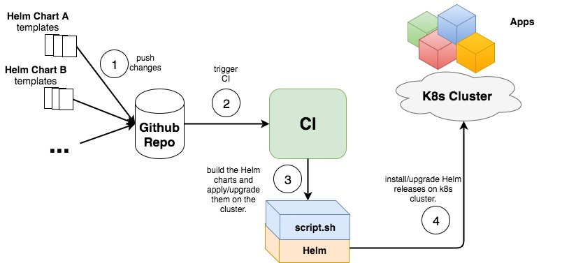
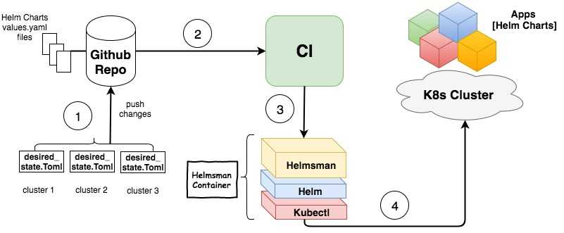

# Why Helmsman?

This document describes the reasoning and need behind the inception of Helmsman.

## Before Helm

Helmsman was created with continous deployment in mind.
When we started using k8s, we deployed applications on our cluster directly from k8s manifest files. Initially, we had a custom shell script added to our CI system to deploy the k8s resources on the cluster. That script could only create the k8s resources from the manifest files. Soon we needed to have a more flexible way to dynamically create/delete those resources. We structured our git repo and used custom file names (adding enabled or disabled into file names) and updated the shell script accordingly. It did not take long before we realized that this does not scale and is difficult to maintain.

## Helm to the rescue?

While looking for solutions for managing the growing number of k8s manifest files from a CI pipeline, we came to know about Helm and quickly releaized its potential. By creating Helm charts, we packaged related k8s manifests together into a single entity "a chart". This reduced the amount of files the CI script has to deal with. However, all the CI shell script could do is package a chart and install/upgrade it in our k8s cluster whenever a new commit is done into the chart's files in git.

But there were a couple of issues here:
1. Helm has more to it than package and install. Operations such as rollback, running chart tests etc. are only doable from the Helm's CLI client.
2. You have to keep updating your CI script everytime you add a chart to k8s.
3. What if you want to do the same on another cluster? you will have to replicate your CI pipeline and possibly change your CI script accordingly.

We have also decided to split the Helm charts development from the git repositories where they are used. This is simply to let us develop the charts independently from the projects where we used them and to allow us to reuse them in different projects.

With all this in mind, we needed a flexible and dynamic solution that can let us deploy and manage Helm charts into multiple k8s cluster independently and with minimum human intervention. Such solution should be generic enough to be reusable for many different projects/cluster. And this is where Helmsman was born!

## The Helmsman way

In English, [Helmsman](https://www.merriam-webster.com/dictionary/helmsman) is the person at the helm (in a ship). In k8s and Helm context, Helmsman holds the Helm and maintains your Helm charts' lifecycle in your k8s cluster(s). Helmsman gets its directions to navigate from a [declarative file](desired_state_specification.md) maintained by the user (k8s admin).

> Although knowledge about Helm and K8S is highly beneficial, such knowledge is NOT required to use Helmsman.

As the diagram below shows, we recommend having a _desired state file_ for each k8s cluster you are managing. Along with that file, you would need to have any custom [values yaml files](https://docs.helm.sh/chart_template_guide/#values-files) for the Helm chart's you deploy on your k8s. Then you could configure your CI pipeline to use Helmsman docker image to process your desired state file whenever a commit is made to it.

> Helmsman can also be used manually as a binary tool on a machine which has Helm and Kubectl installed.
